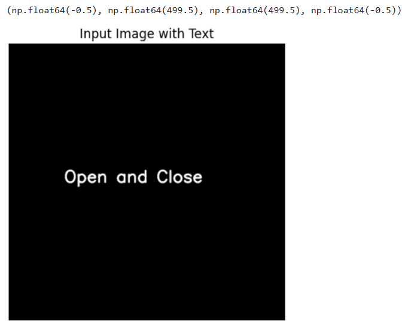
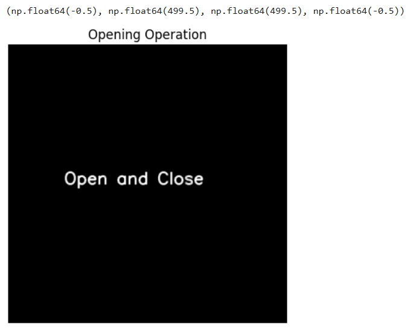
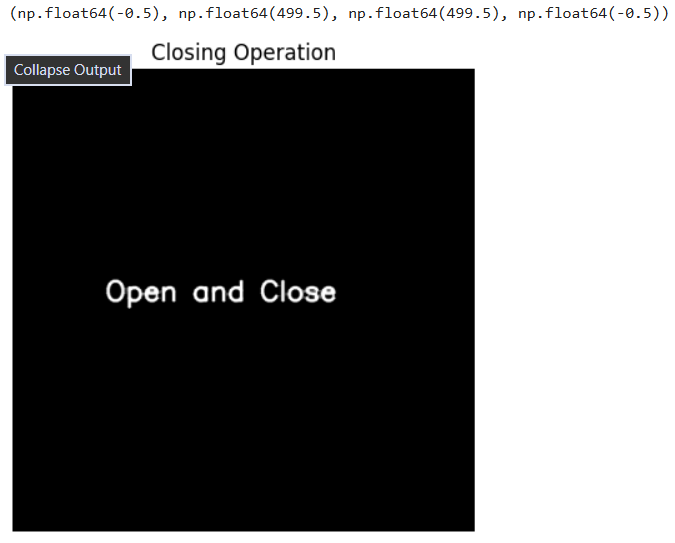

# Exp-10--Record-IMPLEMENTATION-OF-OPENING-AND-CLOSING
# OPENING--AND-CLOSING
# Name : Krithika Lakshmi M
# Reg No : 212224230134
## Aim
To implement Opening and Closing using Python and OpenCV.

## Software Required
1. Anaconda - Python 3.7
2. OpenCV
## Algorithm:
### Step1:
Import the necessary packages


### Step2:
Create the Text using cv2.putText

### Step3:
Create the structuring element

### Step4:
Use Opening operation

### Step5:
Use Closing Operation
 
## Program:

```

import cv2
import numpy as np
import matplotlib.pyplot as plt

image = np.zeros((500, 500, 3), dtype=np.uint8)

font = cv2.FONT_HERSHEY_SIMPLEX
cv2.putText(image, 'Open and Close', (100, 250), font, 1, (255, 255, 255), 2, cv2.LINE_AA)

kernel = np.ones((3, 3), np.uint8)

plt.imshow(cv2.cvtColor(image, cv2.COLOR_BGR2RGB))  
plt.title("Input Image with Text")
plt.axis('off')

opened_image = cv2.morphologyEx(image, cv2.MORPH_OPEN, kernel)

plt.imshow(cv2.cvtColor(opened_image, cv2.COLOR_BGR2RGB))  
plt.title("Opening Operation")
plt.axis('off')

plt.imshow(cv2.cvtColor(closed_image, cv2.COLOR_BGR2RGB))
plt.title("Closing Operation")
plt.axis('off')


```
## Output:

### Display the input Image




### Display the result of Opening



### Display the result of Closing




## Result
Thus the Opening and Closing operation is used in the image using python and OpenCV.